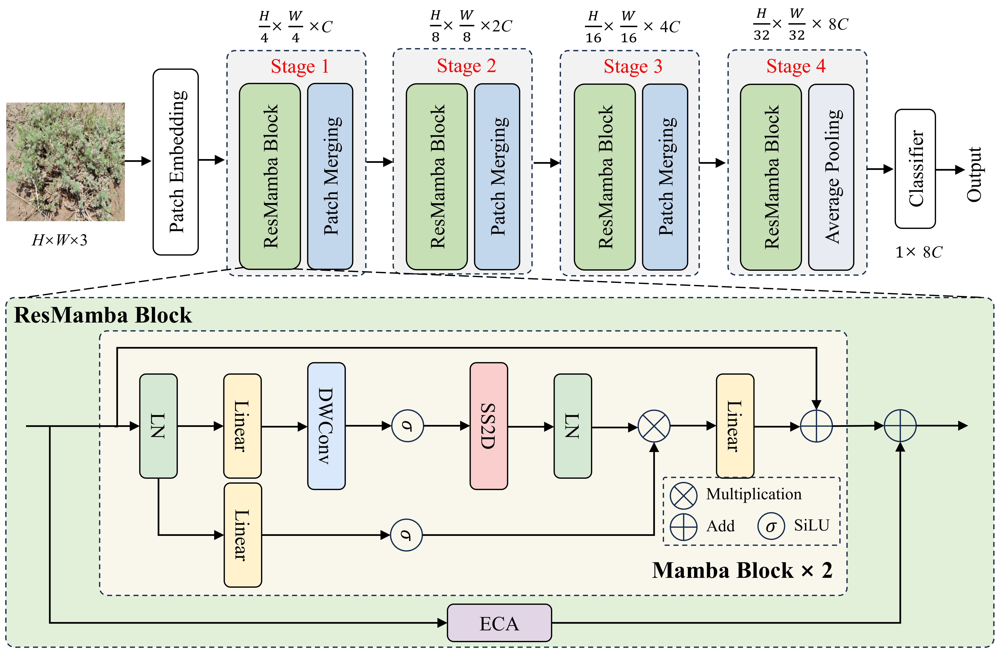
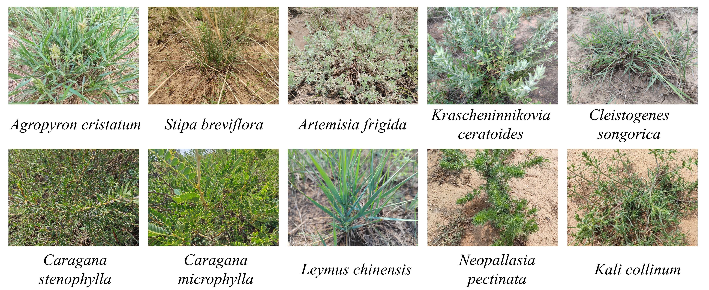
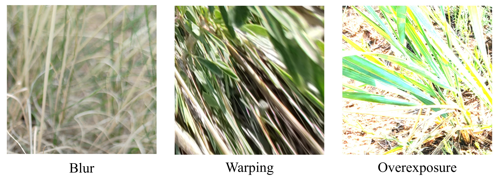

# [ResMamba: A state–space model approach and benchmark dataset for precise forage identification in desert rangelands](https://doi.org/10.1016/j.eswa.2025.127411)


<div align="center">
    
</div>


## Citation

If this code is useful for your research, please cite this paper.

```
@article{zhang2025,
    author = {Tao Zhang and Chuanzong Xuan and Zhaohui Tang and Xinyu Gao and Fei Cheng and Qi Li},
    title = {ResMamba: A state–space model approach and benchmark dataset for precise forage identification in desert rangelands},
    journal = {Expert Systems with Applications},
    year = {2025},
    month = {06},
    volume = {280},
    pages = {127411},
    doi = {10.1016/j.eswa.2025.127411},
}
```

## Visualization

Here is a visualization of the ten forage species from the benchmark dataset.



The data were resized to 224×224 pixels to fit the network input. You can download the dataset from here: [Baidu Netdisk](https://pan.baidu.com/s/10HiJNUz5RX8olnOiJzJyUA?pwd=4ihu) or [Google Drive](https://drive.google.com/file/d/12mQ8_TQNqkqz3NPyiM-2AT6J5W84XGAk/view?usp=drive_link)

Date: October 20, 2024

## Removed Cases:

We excluded images with poor imaging quality, such as those that were blurry, distorted, or had exposure issues.


