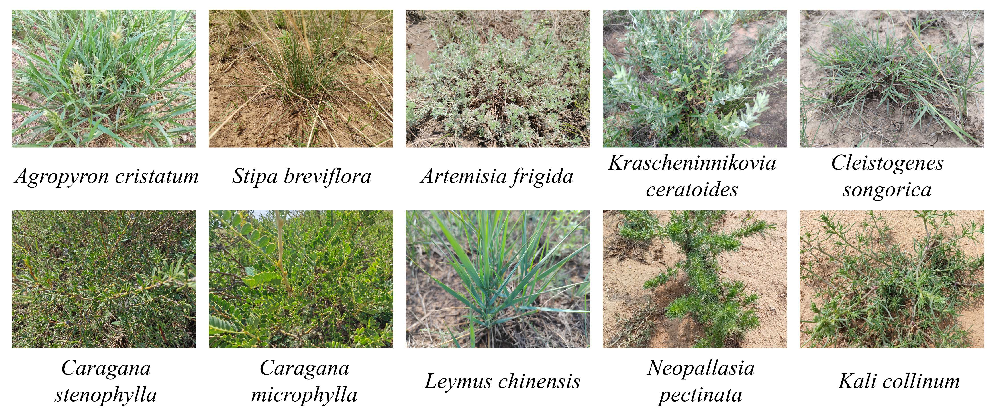
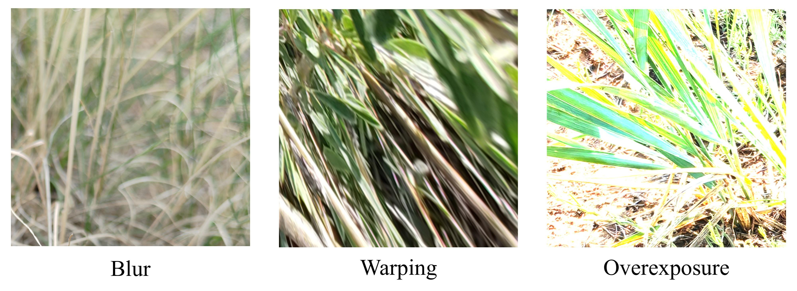

## ResMamba

The dataset and code will be available online once the paper is accepted!

## Visualization

Here is a visualization of the ten forage species from the benchmark dataset.

Date: October 20, 2024

## Removed Cases:

We excluded images with poor imaging quality, such as those that were blurry, distorted, or had exposure issues.

